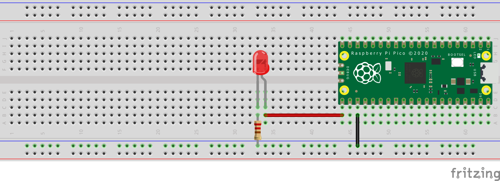

# Raspberry Pi Pico LED Toggle Project

This project demonstrates how to toggle an external LED on or off using a GPIO pin on the Raspberry Pi Pico.
You can use any of the available GPIO pins on the [micro-controller](https://www.google.com/url?sa=i&url=https%3A%2F%2Fwww.raspberrypi.com%2Fdocumentation%2Fmicrocontrollers%2Fraspberry-pi-pico.html&psig=AOvVaw2bAKQoSpHJlQOwX5o-ZRma&ust=1717675579714000&source=images&cd=vfe&opi=89978449&ved=0CBAQjRxqFwoTCKj8zqe2xIYDFQAAAAAdAAAAABAE).

## Prerequisites

To run this project, you'll need the following:

- Raspberry Pi Pico or Pico W
- LED (any color)
- Resistor (220 ohms recommended)
- Breadboard and jumper wires

## Wiring

Connect the components as follows:

- Connect one leg of the LED to physical pin 21 [(pin GPIO 16)](https://www.raspberrypi.com/documentation/microcontrollers/images/pico-pinout.svg) of the Raspberry Pi Pico.
- Connect the other leg of the LED to a resistor (220 to 550 ohms).
- Connect the other end of the resistor to GND (ground) pin, physical pin 23, of the Raspberry Pi Pico/Pico W.

## Installation

1. Clone or download this repository to your Raspberry Pi Pico or Desktop.
2. Ensure you have the [Thonny IDE](https://thonny.org/) installed on your system.
3. Connect your Pico/Pico W to the system with Thonny IDE opened.
4. Install the [MicroPython compiler](https://t.ly/MR9XR) on the Thonny IDE.
5. Copy the codepresent in the `main.py`.
6. Flash the compiled code onto your Raspberry Pi Pico/Pico W or compile the "main.py" file directly from your Desktop.

## Usage

1. Make sure the code is compiled and that Raspberry Pi Pico/Pico W is connected to your system.
2. In case code is flashed onto the micro-controller (Pico/Pico W) itself, make sure the power to micro-controller is also connected.
3. The LED connected to GPIO pin 16 should start blinking.

## Diagram

## Code

The code for toggling the LED is written in MircoPython and can be found in `main.py`. It utilizes the Pico SDK on the [Thonny IDE](https://thonny.org/).

## Contributing

Feel free to contribute to this project by submitting pull requests or reporting issues.
