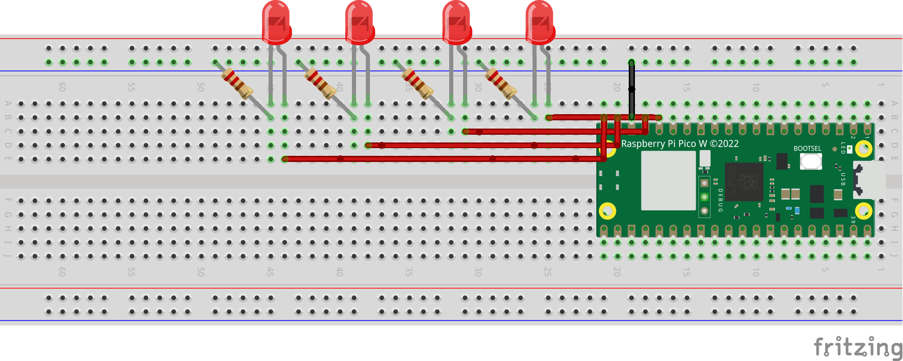

# 4-Bits Binary Counter

This project implements a simple 4-bit binary counter using Raspberry Pi Pico W micro-controller. Four LEDs are attached to the Pico W, representing the four bits of the binary counter. The LEDs turn on and off sequentially after a duration of half-second, indicating numbers 0 to 15.

## Items Used
- Raspberry Pi Pico W micro-controller
- LEDs (4)
- Some wires
- 220 to 550 ohm Resistors (4)

## Circuit Schematic

