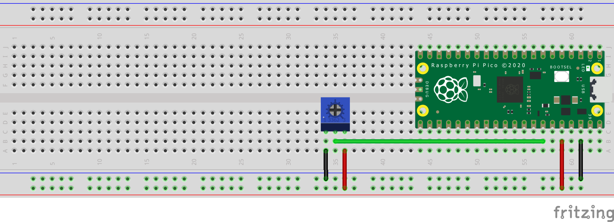

# Analog to Digital Conversion using a Potentiometer

## Introduction
This project demonstrates how to perform analog to digital conversion using a potentiometer with a Raspberry Pi Pico W.

## Components Used
- Raspberry Pi Pico W
- Potentiometer
- Wires

## Circuit Schematics

## Procedure
1. Connect the potentiometer to the Raspberry Pi Pico W using wires.
2. Write and upload the code to read analog values from the potentiometer.
3. Rotate the knob of the potentiometer to fluctuate the voltage readings between 0 volt (minimum) to 3.3 volts (maximum).
4. Interpret the digital readings to determine the potentiometer position.

## Formula to Convert the 16-bit Unsigned Integer Reading to Relevant Voltage Values
The Raspberry Pi Pico reads analog values in binary format and converts them to unsigned 16-bit integers. To represent the actual input voltage to the potentiometer (0 to 3.3V), we use the following formula:

Where:
- `pot_value` is the raw value obtained from the Pico's ADC.
- `65536` is the maximum value of a 16-bit unsigned integer.
- `3.3` is the voltage output from the Raspberry Pi Pico W.
- `voltage` is the equivalent output in voltage format

## Conclusion
Analog to digital conversion allows us to interface analog sensors, like the potentiometer, with digital systems, such as the Raspberry Pi Pico W, enabling a wide range of applications in electronics and beyond.
