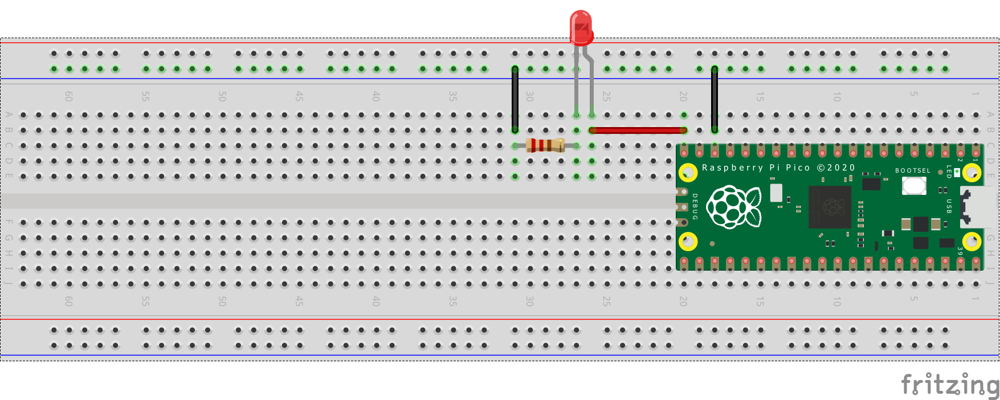

# Controlling the LED based on Python Code Control Flow

This project demonstrates controlling an LED connected to a Raspberry Pi Pico using Python code control flow. The user can input commands to turn the LED on, off, or toggle it.

## Components Required

- Raspberry Pi Pico
- Wires
- LED
- 220 Ohm Resistor

## Circuit Schematics

