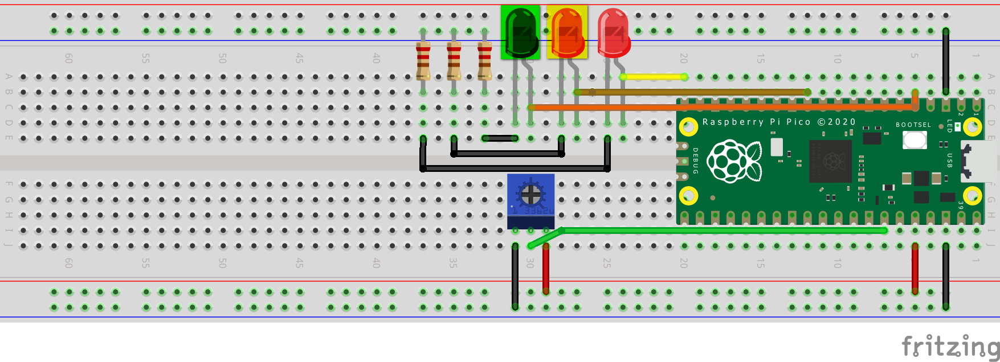

# LED Indicator Controller for Potentiometer-Controlled Voltage

This project utilizes a Raspberry Pi Pico W microcontroller to create an LED-based indicator for potentiometer-controlled voltage. The LEDs change color based on the voltage output from the potentiometer, providing a visual representation of the voltage level.

## Components Required

- Raspberry Pi Pico W
- Wires
- 220 ohm resistors (3)
- Red, green, and yellow LEDs (1 each)
- Potentiometer

## Formula Calculation

The formula used for calculating the voltage level based on the potentiometer resistance is shown in the image above.

## Circuit Schematics

Note: In the circuit schematics, green and yellow LEDs are represented by green and yellow colored-transparent boxes over the default red LEDs, as I could not find more suitable colored LEDs in the Fritzing software.
