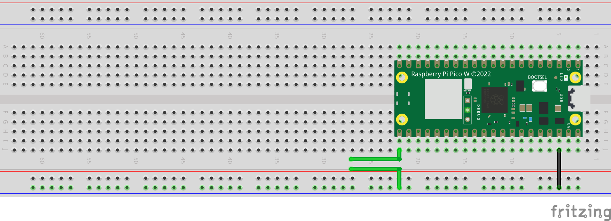

# Observing Pulse-Width-Modulation using Oscilloscope

In this project, we explore Pulse-Width-Modulation (PWM) using a Raspberry Pi Pico W microcontroller. PWM is a technique for generating analog-like signals using digital means, which is particularly useful in applications such as controlling motors, LEDs, and more.

## Project Details

- **Microcontroller:** Raspberry Pi Pico W
- **PWM Pin:** GPIO Pin 16
- **Frequency:** 1000 Hz (1 kHz)
- **Duty Cycle:** Unsigned Integer (16-bit)

The Pico W outputs a maximum of 3.3V, corresponding to 65535 in unsigned integer and 0V corresponds to 0. This conversion is applied using the ratio (65535 / 3.3).

An oscilloscope is connected to GPIO pin 16 of the Pico W, with the ground connected to complete the circuit.

## Required Components
- Raspberry Pi Pico W
- Wires
- Oscilloscope

## Circuit Schematics

Attach the Oscilloscope pins to the green wires, where the positive-high is connected to GPIO pin 16 and the negative-low is connected to the ground.
