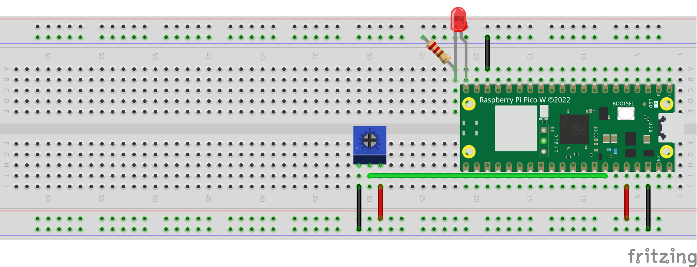

# Controlling the Brightness of an LED

## Description

This project demonstrates how to control the brightness of an LED using a potentiometer connected to a Raspberry Pi Pico W. The potentiometer adjusts the voltage input to an Analog-to-Digital Converter (ADC), which is then used to calculate the brightness level of the LED using a PWM signal. The LED's brightness is adjusted in 16 steps based on the potentiometer reading.

The Pico W reads data from the potentiometer in the form of unsigned 16-bit integer values, which are converted to control the PWM duty cycle and thus the LED brightness.

## Required Components

- Raspberry Pi Pico W
- Wires
- LED (preferably red)
- 220 ohm resistor
- Potentiometer

## Circuit Schematics

