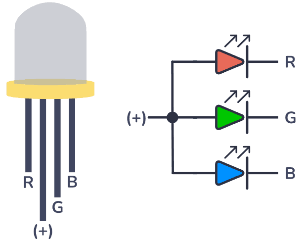
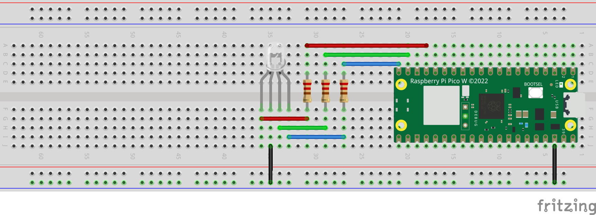

# Controlling an RGB LED with Raspberry Pi Pico W

## Description
This project demonstrates how to control an RGB (Red, Green, Blue) LED using Raspberry Pi Pico W. The intensity of each color is adjusted using Pulse Width Modulation (PWM), allowing for a wide range of colors to be displayed.

## Components Required
- Raspberry Pi Pico W
- RGB LED
- 220 ohm resistors (3)
- Wires

## Circuit Schematics
The circuit diagram illustrates the inner logic of an RGB LED and its pin configuration.

## Setup on Raspberry Pi Pico W
This image showcases the complete setup on the Raspberry Pi Pico W, including the connections and components used for controlling the RGB LED.

