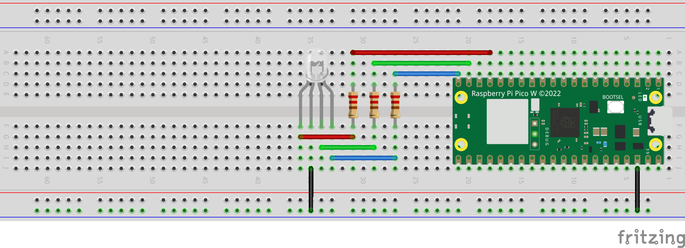

# Sequence of Colors RGB LED with Raspberry Pi Pico W

## Description
This project is an upgrade on the previous two projects. Apart from controlling an RGB (Red, Green, Blue) LED using Raspberry Pi Pico W, the user can specify a sequence of colors and LED will periodically shift colors according to that sequence. The intensity of each color is adjusted using Pulse Width Modulation (PWM), allowing for a wide range of colors to be displayed.

## Colors Available
1. Red (r)
2. Green (g)
3. Blue (b)
4. Cyan (c)
5. Yellow (y)
6. Magenta (m)
7. Sea-Green (s)
8. Violet (v)
9. Orange (o)
10. White (w)

## Components Required
- Raspberry Pi Pico W
- RGB LED
- 220 ohm resistors (3)
- Wires

## Circuit Schematics
The circuit diagram illustrates the inner logic of an RGB LED and its pin configuration.

## Setup on Raspberry Pi Pico W
This image showcases the complete setup on the Raspberry Pi Pico W, including the connections and components used for controlling the RGB LED.

