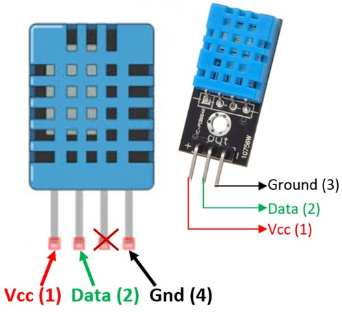
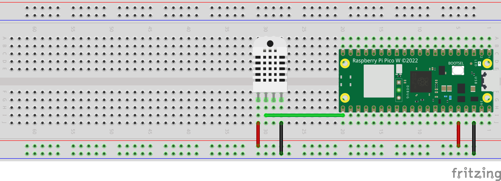

# Using DHT11 Humidity and Temperature Sensor with Pico W
This project demonstrates how to interface a DHT11 humidity and temperature sensor with the Raspberry Pi Pico W using MicroPython. The DHT11 sensor is a low-cost digital sensor capable of measuring relative humidity and temperature.

## Required Components
- Raspberry Pi Pico W
- DHT11 sensor
- Jumper wires

## Information about the Code
- Import Libraries: Imports necessary libraries (machine, utime, DHT11).
- Initialize Pin: Sets up the data pin (data_pin) for communication with the sensor.
- Sensor Initialization: Initializes the DHT11 sensor object.
- Data Reading Loop: Continuously measures temperature and humidity, printing the values to the console every second.

## Circuit Schematics

Below is the pin configuration for the DHT11, Humidity and Temperature sensor module:

Below is the schematics for the complete circuit:

